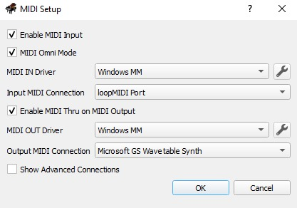

# Midi Gesture

This project is a real-time gesture recognition system to recognize hand gestures and position then convert them into MIDI signals. This project uses [Mediapipe](https://github.com/google-ai-edge/mediapipe) and [openCV](https://pypi.org/project/opencv-python/) to detect hand gestures and [Mido](https://pypi.org/project/mido/) to convert the gestures into MIDI signals.

## Installation & Requirements

<i> Note: This project is only tested on Windows using Python 3.11 </i>

- Install [LoopMIDI from Tobias Erichsen](https://www.tobias-erichsen.de/software/loopmidi.html) and create a virtual MIDI port. Recommended to use the default name "LoopMIDI Port 1" or change the port name in the main.py.

- Install some MIDI software or VST plugin to test the MIDI signals. You can use simple one like [Virtual MIDI Piano Keyboard](https://vmpk.sourceforge.io/).

- Set the virtual MIDI port as the input in the MIDI software. For VMPK, Edit > Midi Connections


- Clone this repository using the following command:

```bash
git clone https://github.com/jo0707/midiGesture
```

To install the required packages, you can run the following command:

```bash
pip install -r requirements.txt
```

Or, using virtual environment:

```bash
python -m venv venv
Set-ExecutionPolicy Unrestricted -Scope Process # for Windows (Powershell)
venv\Scripts\activate
pip install -r requirements.txt
```

## Usage

To use the system, make sure your MIDI software is running and the virtual MIDI port is set as the input. Then, run the following command:

```bash
python main.py
```

The system will then start detecting index finger and thumb gestures. The gestures are as follows:
- Index finger pointing up : Play note
- Index finger touching thumb : Stop note
- Index finger bent : modulate pitch

#### Note:
<i> The system is still in development (and always) and may not work as expected. </i>